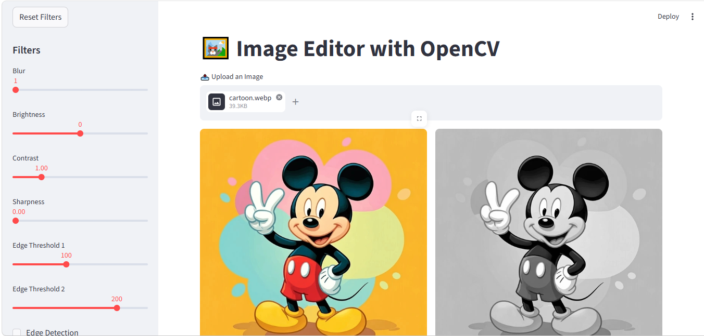

#  Image Editor with Streamlit & OpenCV

##  Project Description

This project is a browser-based Image Editing Application built using Python.
It allows users to upload an image, apply multiple image processing filters, preview the results in real time, and download the edited image.

The application uses:

* **Streamlit** for the user interface
* **OpenCV** for image processing
* **NumPy** for image array manipulation

---

##  Features

*  Upload images (JPG, JPEG, PNG)
*  Apply multiple filters using sliders and checkboxes
*  Real-time preview of changes
*  Filters are stackable (applied sequentially)
*  Download edited image as PNG

---

##  Filters Implemented

1. **Blur** – Smooths the image using Gaussian Blur
2. **Brightness** – Adjusts image intensity
3. **Contrast** – Enhances or reduces contrast
4. **Sharpness** – Highlights edges
5. **Edge Detection** – Detects edges using Canny algorithm
6. **Grayscale** – Converts image to grayscale

---

##  Technologies Used

* Python
* Streamlit
* OpenCV
* NumPy
* Pillow

---

##  Project Structure

```
image_editor/
│
├── app.py              # Main Streamlit app
├── filters.py          # Image processing functions
├── utils.py            # Helper functions
├── requirements.txt    # Dependencies
└── README.md           # Project documentation
```

##  Application Preview



---

##  Demo Video

(shirishavattikota99/Image_Editor)

---

##  Key Concepts Learned

* Image representation using NumPy arrays
* OpenCV image processing techniques
* Building interactive UI using Streamlit
* Image format conversion (PIL ↔ NumPy ↔ Bytes)
* Writing modular and maintainable code

---

##  Future Improvements

* Add more filters (sepia, cartoon, HDR)
* Add image cropping & resizing
* Deploy the app online

---

##  Author

V. Shirisha

---
